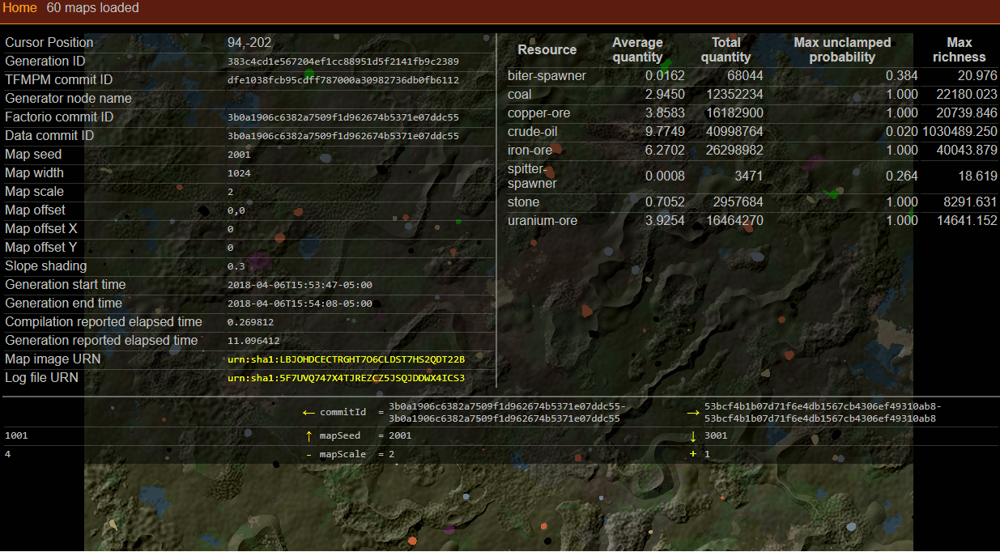

# TOGoS's Factorio Map Preview Manager



- ```make rebuild-database``` - create the map SQLite database.
- ```util/generate-map-preview``` - generate a preview.
  Information will be stored into ```logs/(current date in Y_m_d format).jsonl```,
  and also into the SQLite database.
- ```make dev_www_server=0.0.0.0:6061 run-web-server``` - run the web server,
  which you can use to view your map collection.

## Map preview generator

```util/generate-map-preview```

Takes several parameters that indicate which map to generate.
If you don't specify enough, it will complain and crash.

```--factorio-commit-id``` indicates the commit hash from the Factorio repository to use.
In the future I may change this to allow specific versions that we've released headless
Docker images for so that you can use this tool without having to have access to the repository.

It will try to use a Docker image tagged ```factorio/factorio:<commit-hash>-headless```.
If that does not exist, it will clone the local git repository as configured in [```config/factorio.json```](config/factorio.json.example)
and attempt to ```make docker/factorio-headless``` in order to build (and tag) said image.
This only works on relatively new revisions of the codebase.
You may use versions that don't know how to ```make docker/factorio-headless```
so long as you can generate the correctly tagged Docker image yourself.


## Viewer

Viewer will automatically pick dimensions for available data.

First for left-right, then for up-down.  Zoom in/out always changes scale.

- Factorio commit ID / data commit ID
- Map seed
- Water level
- ...other controls...
- Map offset X
- Map offset Y
- Map width

## Other stuff

This is a PHPTemplateProject-based project,
which means it's got a lot of boilerplate stuff built in for doing JSON web services.
Cruft is crufty.
